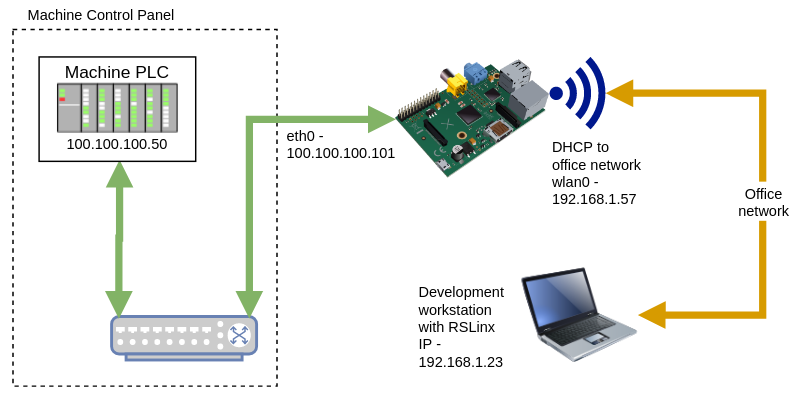

# rpi-plc-gateway
Raspberry Pi - Wireless to Wired PLC Targeted Router Manager

## Description
This project is intended to contain everything that is required to build a 3.5" Touchscreen Raspberry Pi that can be used to route network traffic from a wireless network to an island LAN network on the industrial machine.  Specifically the application in this repo is targeting an EthernetIP PLC at port 44818 so that a remote PC running a development environment using RSLinx can make a direct connection to the PLC.

## Technology
A Raspberry Pi with a 3.5" touchscreen was selected to host the application because of its small size and low price.  The standard Raspbian Desktop OS was selected as the operating system because of its wide support and well documented instructions.  Nodejs and Electron will be used as the platform for the router manager application.  Electron makes it easy to create a small user friendly interface and also provides the opportunity to create a webbased version in the future.  Nodejs is well supported.

## Typical Architecture
Typically this will be used to access a machine's local network.  Connect an Ethernet cable between the port on the Pi and the switch in the main control panel that is connected to the PLC.  Then connect to the office network over wifi.  (It is assumed that the Ethernet port will be statically addresses and the wifi will be DHCP (or dynamically) addressed.



## Bill of Material
1. Raspberry Pi 3B+, 16GB Micro SD Card and 2.0A power adapter. (The touchscreen and case that have been selected will not work with the Pi 4.)
2. Raspberry Pi 3.5" touchscreen and case. 
<br/>https://smile.amazon.com/gp/product/B07N38B86S/ref=ppx_yo_dt_b_asin_title_o01_s00?ie=UTF8&psc=1
3. Circular magnet (1.26" diameter) with double-sided adhesive.
<br/>https://smile.amazon.com/gp/product/B076Z81891/ref=ppx_yo_dt_b_asin_title_o08_s00?ie=UTF8&psc=1
4. Circular felt (1" diameter) with self adhesive.
<br/>https://smile.amazon.com/gp/product/B01C2EMIIS/ref=ppx_yo_dt_b_asin_title_o08_s00?ie=UTF8&psc=1

## Raspberry Pi Setup
The following steps were used to install and configure the Raspberry Pi.

### Initial OS Installation
For the initial installation, the touchscreen was not mounted.  Instead a standard monitor was connected to the HDMI port.  The latest (as of 06/23/2020) Raspbian Desktop OS image was downloaded and transferred to the 16GB micro SD card using dd.  No special steps were taken during the installation other than connecting to the local wifi for internet access, selecting the appropriate localization options and allowing the update to be performed.  

#### Raspberry Pi Configuration (raspi-config)
Enable the SSH command with password access.  In order to use the touchscreen drivers the SPI kernel module must be enabled.  After the configuration changes are made reboot the Pi and run ```ip addr``` to get the IP address at wlan0.  This will be used to ssh into the Pi for the Touchscreen Driver Installation.

### Touchscreen Driver Installation
1. With the Pi powered off, mount the touchscreen.  Installation instructions can be found here:
<br/>http://www.lcdwiki.com/MHS-3.5inch_RPi_Display#How_to_use_in_the_Raspberry.2FUbuntu_Mate.2FKali.2FRetropie_system
2. Once the screen is mounted turn on the Pi.  (Note: The display will remain blank until the drivers have been installed.)
3. Using another computer ssh into the Pi. (e.g.```ssh pi@192.168.1.57```, change IP to the address exposed by the ```ip addr``` command from earlier.)  
4. Since the base OS has already been installed go to step 3 of the lcdwiki instructions.  This will reboot the Pi and the desktop should now appear on the touchscreen.
  ```
  git clone https://github.com/goodtft/LCD-show.git
  chmod -R 755 LCD-show
  cd LCD-show/
  sudo ./MHS35-show
  ```
  

5. Optionally, this might be a good place to make an image of the micro SD card.

### Router and Port Forwarding Configuration

## Installation

### Node and Electron Installation

### Application Installation

### Start on Boot Configuration

## Example Connection Using RSLinx
